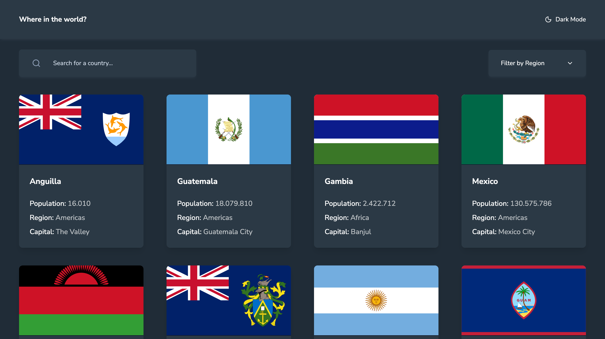

# Frontend Mentor - REST Countries API with color theme switcher solution

This is a solution to the [REST Countries API with color theme switcher challenge on Frontend Mentor](https://www.frontendmentor.io/challenges/rest-countries-api-with-color-theme-switcher-5cacc469fec04111f7b848ca). Frontend Mentor challenges help you improve your coding skills by building realistic projects. 

## Table of contents

- [Overview](#overview)
  - [The challenge](#the-challenge)
  - [Screenshot](#screenshot)
  - [Links](#links)
- [My process](#my-process)
  - [Built with](#built-with)
- [Author](#author)

## Overview

### The challenge

Users should be able to:

- See all countries from the API on the homepage
- Search for a country using an `input` field
- Filter countries by region
- Click on a country to see more detailed information on a separate page
- Click through to the border countries on the detail page
- Toggle the color scheme between light and dark mode *(optional)*

### Screenshot

### Links

- Solution URL: [Open in Frontendmentor](https://www.frontendmentor.io/solutions/countreelist---country-list-viewer-built-with-react-vite-tailwind-D5o2vcSt1b)
- Live Site URL: [See the site live](https://countreelist.netlify.app/)

## My process

### Built With
- React.Js + Vite
- REST Countries API
- Typescript
- Tailwind CSS
- Motion (Framer Motion)
- Flexbox
- CSS Grid
- Mobile-first workflow
- [React](https://reactjs.org/) - JS library
- [Vite](https://vite.dev/) - React framework
- [TailwindCSS](https://tailwindcss.com/docs/installation/using-vite) - For styles
- [Zustand](https://zustand.docs.pmnd.rs/) - For state management
- [Motion](https://motion.dev/) - For animation

## Author

- Frontend Mentor - [@codesbyree](https://www.frontendmentor.io/profile/codesbyree)
- Twitter - [@growth_ree](https://x.com/growth_ree)
- Instagram - [@codesbyree](https://www.instagram.com/codesbyree/)
